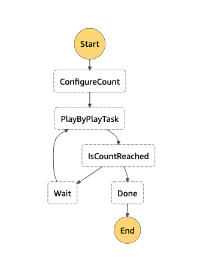

# State Machine with sub-minute Loop

This CDK creates a state machine for a 3 seconds loop to trigger a lambda function.



## Get Started

```sh
git clone https://github.com/aws-samples/aws-cdk-state-machine-with-sub-minute-loop.git
cd aws-cdk-state-machine-with-sub-minute-loop
npm install
```

## Deployment

```sh
npx cdk bootstrap
npx cdk deploy
```
